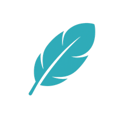

<div align="center">



# LangFeather

*See what your LangGraph app actually ran — on your own machine.*

[](https://pypi.org/project/langfeather/)


[](LICENSE)

[한국어](README.md) · English

</div>

LangFeather captures callback-visible Runnable, LLM, retriever, and tool runs,
then lets you inspect original input/output, errors, and latency in a local UI.
It keeps the debugging features needed for a LangGraph project without trying to
reproduce a full hosted observability platform.

## What you get

- **Traces** — see Runnable, LLM, retriever, and tool runs as a node graph, and
  inspect the original input/output as a collapsible tree.
- **Overview** — trace counts, latency percentiles, error rate, and score trends
  for the selected time range and filters.
- **Evaluate** — build datasets and experiments, then compare up to four
  experiments on the same dataset revision, evaluator by evaluator.
- **Scores & Queues** — define boolean, numeric, and categorical scores, and
  annotate runs by hand in a queue.

## Current scope

`0.3.2` is a local-first, single-project, single-user prototype. The collector
runs on your own machine and binds to `127.0.0.1:4319` by default. Login, cloud
collection, team sharing, and public EC2 deployment are not supported yet.

> [!WARNING]
> Trace payloads are stored in local SQLite without automatic redaction,
> truncation, or sampling. Do not send secrets or production data.

## Quick start

Run the collector:

```bash
docker run -d --name langfeather \
  -p 127.0.0.1:4319:4319 \
  -v langfeather-data:/data \
  ghcr.io/sungjinwi99/langfeather:0.3.2
```

Open <http://127.0.0.1:4319>, install the SDK, then wrap the compiled graph you
actually call:

```bash
pip install "langfeather[langchain]"
```

```python
import langfeather

langfeather.configure(endpoint="http://127.0.0.1:4319")
graph = langfeather.wrap_runnable(compiled_graph, name="my-langgraph-app")
result = graph.invoke(
    {"question": "Summarize the retrieved documents."},
    {"configurable": {"thread_id": "example-session"}},
)
```

`compiled_graph` is the existing result of `StateGraph.compile()`.

## Documentation

The detailed docs are Korean-first:

- [Getting started](docs/getting-started.md)
- [Tracing LangGraph](docs/guides/tracing-langgraph.md)
- [Monitoring and evaluation](docs/guides/monitoring-and-evaluation.md)
- [Troubleshooting](docs/guides/troubleshooting.md)
- [Python SDK](sdk/python/README_EN.md)
- [Contributing](CONTRIBUTING.md)
- [Changelog](CHANGELOG.md)

The current product scope and technical contracts live in [specs](specs/). If you
contribute with AI, start from the [.agents guide](.agents/README.md).

## Feedback and contributing

`0.3.2` is the stage for using LangFeather in a real LangGraph project and
finding out what installation, adoption, and missing features feel like. Please
report bugs, setup friction, and feature ideas on
[GitHub Issues](https://github.com/SungjinWi99/LangFeather/issues).

Small features can be contributed as PRs with AI assistance. The
[contributing guide](CONTRIBUTING.md) explains which spec to read, how to write a
focused test, and how to keep the change scoped.

## License

LangFeather is distributed under the [Apache License 2.0](LICENSE).
